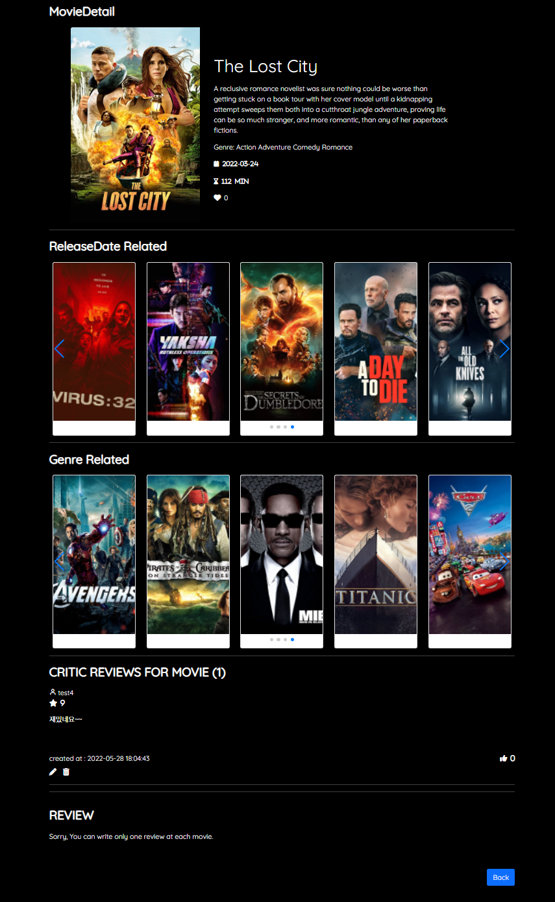
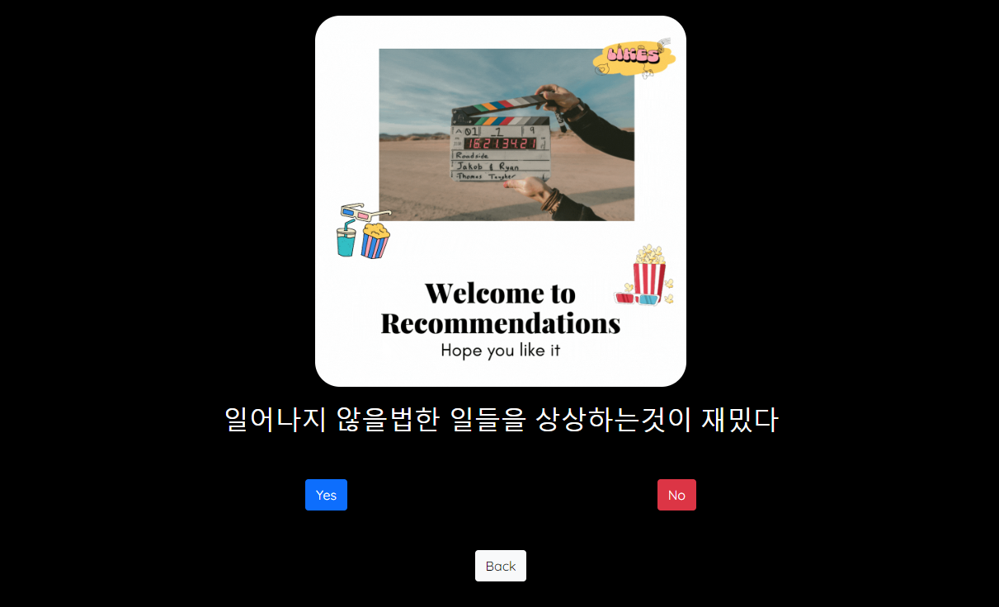

# SAFFY 1학기 최종 프로젝트 - EURACHACHA(2022-05-20~2022-05-26)

## 1.:ledger: PJT summary

- 팀명: DH96s - 둘 다 이름의 이니셜이 DH이고, 96년생이다
- 프로젝트명: EURACHACAH - WATCHA에서 네이밍 영감을 얻었다
- 주제: 추천 알고리즘을 적용한 영화 커뮤니티 사이트
- 기간: 05.20(금) ~ 05.26 (목)
- 발표: 05.27 (금, 종강식날)
- 조원: 김도현[[깃헙](https://github.com/MoCCo329/fresh-tomatoes-vue)] FE, CSS styling, 이동환[[깃헙](https://github.com/onghwand/fresh-tomatoes-django)] BE, CSS styling
- 사용기술스택:
  - 협업, 버전관리 :    
  - 언어 :    
  - FE/BE framework :  
  - DB : 
  - 배포 :  
  - 디자인 :   

## :handshake: 2. Github Conventions

- 브렌치 명을 어떻게 할까?
  - master: 운영 서버로 배포하기 위한 브랜치
  - django: 백엔드를 개발하는 브랜치
  - vue: 프론트엔드를 개발하는 브랜치

- BUT FE파일과 BE파일을 따로 관리하는것이 더 용이하겠다고 생각되어 3일차부턴 repository를 분기했고, 위 브렌치 명은 쓰지 않게 됐다.

 

- Commit Convention

  - Fix : 잘못된 동작을 고칠 때

    > Fix typo in Home.vue

  - Add : 새로운 것을 추가할 때

    > Add Detail.vue

  - Remove : 삭제가 있을 때

    > Remove Detail.vue

  - Update : 정상적으로 동작하는 파일을 보완하는 경우

    > Update login logic to accounts.js

## 3. :dolphin: DB

- ERD

- 데이터 수집 및 가공
  - 데이터출처: kaggle이라는 사이트에서 tmbd 영화 데이터 약 5천개를 CSV파일로 받아 json으로 변환
  - 가공: 원하는 필드값이 부족한 결측치, 이상치를 제거하고 총 4771개를 sqlite3에 넣어 dump

## 4. :file_cabinet: Components

- Component Schema
  - Articles : 영화에 대한 게시물을 작성, 수정, 삭제, 읽기 기능, 게시물에 대한 댓글 작성, 수정, 삭제, 읽기 기능
  - Movies : 현재 상영중인 영화, 인기 영화, 개봉 예정 영화, 각 영화에 대한 세부 정보, 리뷰 작성, 수정, 삭제 기능
  - Search : 검색어로 관련된 영화 정보 검색 기능
  - Recommendation : 사용자의 취향을 반영한 영화 추천 기능
  - Accounts : 회원가입, 로그인, 로그아웃 기능

## 5. :thumbsup: Recommendations

- 같은 취향의 유저: 사용자와 비슷한 영화들에 좋아요를 누른 유저를 찾아 해당 인원이 좋아요 누른 다른 영화를 추천한다.
  - 구현 방식: BE를 통해서만 계산된다.
    - 사용자가 좋아요 누른 영화들과 교집합이 가장 큰 다른 유저를 search.
    - 찾은 유저가 좋아요 누른 다른 영화를 추천한다.

- 다섯고개: 몇가지 질문을 통해 사용자의 취향을 파악하여 영화 추천
  - 구현 방식 : 한번 추천에 약 5개의 질문, 같은 질문을 반복한다고 덜 느끼도록 하는것이 목표.
    - FE에서 영화 DB field별로 질문들을 던진다. 질문field별로 컴포넌트가 존재하며, 랜덤으로 질문 컴포넌트를 표시한다.
    - 컴포넌트 안에서도 랜덤으로 질문을 하여 원하는 답을 얻으면 부모로 답변값과 질문 컴포넌트 변환요청을 EMIT.
    - 답변들을 모두 수집하면 BE로 전송, BE에서 알맞게 필터링하여 값을 만족하는 영화들을 응답한다.

## 6. :gear: Data Flow(Search 기능 예시)

- 프로젝트 규모상 계속해서 관리되는 영화정보 DB를 만들기 어렵기 때문에, TMDB 영화정보 API를 통해 이 문제를 해결한다.

  BE에서 경우에 따라 TMDB API에 요청을 보내고, 해당 영화정보가 DB에 없는지 파악한 뒤, 없다면 DB에 데이터를 추가하여 DB를 관리한다.

## 7. :film_strip: 결과 및 배포

- Home

  

- Movie Detail

  

- Search

  

- Recommendations

  

  

  

- Article

  

  

- Profile

  

## 8. 느낀점 및 디테일

- 밤을 새며 엄청난 웹페이지를 만들겠다고 호기롭게 시작했지만 밤을 새지도 못했고 계획한 것 중에 어쩔 수 없이 버리고 진행한 것들이 많았다. 계획의 중요성을 많이 강조하셨는데 마음이 급하다 보니 ERD도 그렇고, 프로토타이핑도 그렇고 대충하고 지나갔던 것 같다. 동시에 ERD 그리는 법, FIGMA와 같은 페이지 설계를 도와주는 툴 이용법을 조금은 익힐 필요성을 느꼈다. 
-  다른팀들보다 스타일링을 빠르게 시작했지만 디자인에 자신이 없어서 뒷 배경을 검정색으로 가는 깔끔함을 선택했고 결과물에도 나름 만족했다. 하지만 다른 팀들 홈 화면을 보는데 예고편 영상, 혹은 감성적인 배경을 어울리게 넣은 것을 보고 깜짝놀랐다. 또는 hover를 했을 때 사용자가 직관적으로 느낄 수 있게끔 아이콘에 변화를 준다거나, 선호 영화를 자연스럽게 선택할 수 있게끔 유도하거나, 좋아하는 영화를 선택 안했을 때는 문구를 띄워준다거나 인지하지 못하고 사용했던 기존 웹페이지들의 작은 기능 하나하나에 대해 새롭게 인지할 수 있게 되었다. (물론 이번 우리의 결과물에서는 반영 안된 것들이 많아서 아쉬웠다.) 
- 마지막으로는 배포가 가장 아쉬웠다. AWS EC2를 통해서 배포에만 한 이틀은 쓴 것 같은데 일단 collectstatic파일 경로가 잘못되었는지 API서버에 스타일이 제거되었고, 몇시간이 지나면 '페이지를 로드하는데 시간이 오래 걸린다'라는 문구와 함께 접속이 안되었다. 아직도 해결을 못했는데, 결국 포기하고 헤로쿠로 넘어갈까 생각중이다.
- 뭔가 처음부터 끝까지 홈페이지를 만들 수 있을까라는 의문을 가지고 시작한 SSAFY였는데, 나름 깔끔한? 홈페이지를 만들어서 꽤나 만족스러운 한 학기가 된 것 같다.

- [DETAIL.md](./DETAIL.md)